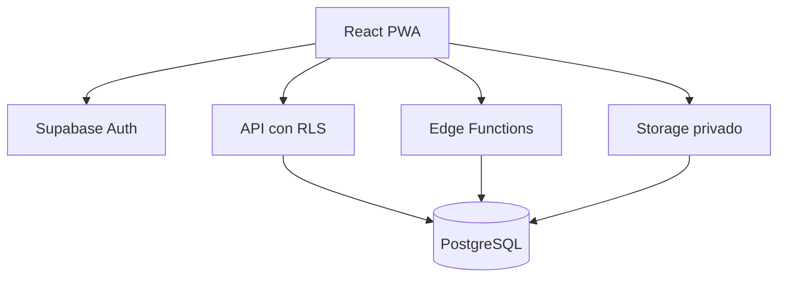

# Arquitectura de ONUr Beta

## Decisión

La Beta utiliza una SPA React/Vite y un backend administrado en Supabase. Para un único profesional reduce infraestructura inicial sin renunciar a PostgreSQL, control por filas, almacenamiento privado y funciones de servidor.

## Componentes

## Fronteras

- El navegador usa únicamente la clave pública de Supabase.
- La clave `service_role` existe solo en Edge Functions.
- Los datos clínicos se protegen con RLS aunque una solicitud se ejecute desde el cliente.
- Las operaciones administrativas de cuentas y auditoría pasan por funciones de servidor.
- Los documentos clínicos se guardan en un bucket privado.

## Módulos del frontend

- `components`: elementos visuales compartidos.
- `pages`: pantallas y flujos.
- `data/demo.ts`: datos ficticios, reemplazables por consultas.
- `lib/auth.ts`: contrato de acceso profesional y paciente.
- `lib/supabase.ts`: cliente público opcional.
- `types/domain.ts`: tipos del dominio.
- `features/exercise`: motor canvas, configuración y reproductor.
- `features/patients`: repositorio, validación y consultas de pacientes.
- `features/sessions`: ciclos, planes versionados, asignaciones y ejecución secuencial.
- `features/documents`: Storage privado, metadatos y permisos.
- `features/assessments`: cuestionario físico, transcripción y comparación descriptiva.
- `features/statistics`: agregaciones operativas puras para sesiones y cuestionarios, sin reglas clínicas.
- `pages/StudiesPage`: índice profesional de Posturografías y vHIT con filtros y acceso a revisión.
- `features/reports`: instantáneas versionadas por ciclo.
- `features/access`: gestión profesional del portal y revocación.
- `features/templates`: biblioteca de configuraciones visuales.
- `features/studies`: diccionario de métricas, normalización, calidad, importación y sugerencias.

## Modelo de datos

La identidad del paciente se separa de:

- ciclos de tratamiento;
- estudios y documentos originales;
- valores métricos estructurados;
- incidencias de calidad;
- sugerencias estadísticas;
- planes, asignaciones y ejecuciones;
- permisos de documento;
- eventos de auditoría.

Un estudio puede contener múltiples lados, frecuencias, condiciones y repeticiones. Una fila importada nunca se interpreta automáticamente como una persona.

## Flujo de importación

1. Selección de paciente y archivo.
2. Identificación de protocolo y versión.
3. Mapeo de origen a métrica.
4. Controles de calidad.
5. Confirmación profesional.
6. Ejecución de reglas aprobadas.
7. Revisión de sugerencias.

## Próximos incrementos

1. Configurar un proyecto Supabase de staging y ejecutar migraciones.
2. Pruebas automáticas de RLS y Edge Functions.
3. Validar con archivos reales los mapeos de cada versión del posturógrafo y vHIT.
4. Extracción OCR asistida, siempre con confirmación profesional.
5. Exportación PDF de informes en servidor y firma profesional.
